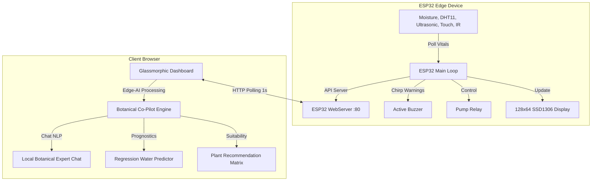

# BioSphera IoT: Intelligent Plant Sentinel 🌿

[](https://www.espressif.com/)
[](./)
[](./)
[](https://github.com/Jeswin44/plant-monitoring-system)

**BioSphera IoT** is a premium, state-of-the-art smart plant monitoring and automated irrigation system. Driven by an **ESP32 microcontroller** edge-node and a high-performance **glassmorphic 3D web dashboard**, BioSphera acts as an intelligent guardian for your house plants. 

The dashboard operates locally under an offline ESP32 Access Point network, pulling fresh telemetry every second, running rolling regression mathematical projections for drying soil curves, and offering an **Edge-AI Botanical Co-Pilot** chatbot to guide plant care.

---

## 🌟 Visual Preview & Showcase

The web dashboard is styled with ultra-modern **dark-mode glassmorphism** featuring:
- **Sentient Flora Centerpiece:** A responsive vector SVG plant that sways organically, droops under drought stress, blushes red on warnings, sways rapidly on capacitive touch interactions, and glows to reflect ambient status.
- **Wave Fluid Tank Gauge:** Shows precise reservoir volume with dynamic wave physics.
- **Proximity Radar Sweeps:** Radiates real-time sweeping radar grids when the hardware IR sensor detects presence.
- **3D Interactive Sim Mode:** A full-featured hardware mock console letting you slide vitals, toggle IR/Touch states, test emergency scenarios, and simulate pump cycles.

---

## ⚙️ Core System Architecture



---

## 🚀 Key Features

### 1. Embedded Firmware Capabilities (`plant_monitoring_system.ino`)
* **Multi-Sensor Aggregation:** Integrates soil moisture (capacitive/resistive), air temperature & humidity (DHT11), reservoir level (HC-SR04 ultrasonic), capacitive touch (ESP32 touch pin 27), and IR barrier proximity detection (pin 32).
* **Dual-State OLED UI paging:** Displays moisture, climate indices, tank capacity, and active alerts on a physical `128x64 SSD1306` screen with rotating screens.
* **Non-Blocking Pump Cycle:** Prevents root rot and overflow through a timed duty cycle (`3s` pump runtime) followed by an automated `10s` stabilization cooldown (`WAIT` state).
* **Hardware Emergency System:** Shuts down all high-power loads instantly when a hardware line cutoff is requested, rendering warning frames on both the OLED and dashboard.
* **Warning Buzzer Pitch:** Synthesizes sound sweeps for system initialization, buzzer validation tests, and repeating beeps when the water reservoir is critical.

### 2. Premium Glassmorphic Web Dashboard (`index.html`, `styles.css`, `app.js`)
* **Live Telemetry Interface:** Updates connection badges, response latencies, and vitals clocks at an ultra-fast `1.0s` loop.
* **Historical Memory Retention:** Standardizes telemetry fallback cache (`smartPlantLastData` in `localStorage`) to retain previous logs if the ESP32 briefly drops off the network.
* **Acoustic Warn Engine:** Synthesizes elegant warnings through browser **Web Audio API** osc-nodes so notifications sound native without using bulky `.mp3` assets.
* **Fully Responsive Console:** Adapts flawlessly across smartphone, tablet, and 4K ultra-wide monitors.

### 3. Edge-AI Botanical Co-Pilot
* **Vitals Diagnostic Processor:** Evaluates telemetry points instantly to diagnose stress conditions (e.g., *Heatwave stress*, *Cold stress*, *Drowning roots*, *Dehydrated soil*).
* **Rolling Soil Drying Slope:** Computes drying coefficients using a running queue of soil logs. Provides estimated next watering times based on active evaporation rates.
* **Dynamic Ambient Plant Matcher:** Displays 5 optimal plants matching your current room conditions. To cater to Indian households, the system prioritizes Indian botanical staples, drawing from:
  1. **Tulsi (Holy Basil)** 🌿 - Perfect for moderate humidity, highly adaptive.
  2. **Aloe Vera** 🌵 - Thrives in low-moisture and dry-soil environments.
  3. **Money Plant (Pothos)** 🌱 - Thrives in moderate to high indoor humidity.
  4. **Curry Leaf Plant (Kadi Patta)** 🍃 - Loves warm conditions with moderate soil dampness.
  5. **Snake Plant** 🔋 - Extremely resilient, excellent for dry standard household rooms.
* **Local NLP Chatbot Consultation:** Interactive chatbot allowing direct queries. Users can ask about system safety states, pump cool-downs, suitable matching flora, or manual irrigation.

---

## 🔌 Hardware Pinout Specification

Below is the standard wiring map recommended for assembling the BioSphera IoT station:

| Component | Pin (ESP32) | Mode | Purpose |
| :--- | :---: | :---: | :--- |
| **Soil Moisture Sensor** | `GPIO 34` | Input (Analog) | Reads raw moisture voltages (Calibrated: 1352=Wet, 4095=Dry) |
| **Pump Control Relay** | `GPIO 23` | Output | Drives high-power DC sub-pump via BC548 NPN transistor |
| **HC-SR04 Trigger** | `GPIO 18` | Output | Transmits ultrasonic sonar burst |
| **HC-SR04 Echo** | `GPIO 19` | Input | Receives ultrasonic echo timing back |
| **DHT11 Data** | `GPIO 4` | Input | Pulls ambient air temperature & humidity values |
| **Capacitive Touch** | `GPIO 27` | Input (Touch) | Register human touch/interaction to sway plant |
| **IR Proximity Sensor** | `GPIO 32` | Input (Digital)| Active-LOW sensor reporting when hand approaches |
| **Active/Passive Buzzer** | `GPIO 26` | Output (PWM) | Produces alert frequencies and system chirps |
| **SSD1306 OLED SDA** | `GPIO 21` | I2C Data | Interfaces serial OLED display lines |
| **SSD1306 OLED SCL** | `GPIO 22` | I2C Clock | Supplies clock signals to OLED |

---

## 📡 REST API Specifications

The ESP32 runs a lightweight REST endpoint engine. Standard payloads are delivered over HTTP:

### 1. Telemetry Log Fetch
* **Endpoint:** `GET http://192.168.4.1/api/data`
* **Response Content-Type:** `application/json`
* **JSON Payload Structure:**
```json
{
  "soil": 45,
  "soilStatus": "OK",
  "pump": "OFF",
  "water": 72,
  "tankStatus": "OK",
  "temperature": 24.50,
  "humidity": 55.00,
  "touch": 0,
  "ir": 0,
  "emergency": 0
}
```

### 2. Buzzer Chirp Verification
* **Endpoint:** `GET http://192.168.4.1/api/buzz`
* **Description:** Sweeps buzzer frequency across a `300ms` activation. Used for hardware test checks.
* **JSON Response:**
```json
{
  "success": true,
  "message": "Buzzer tested successfully"
}
```

### 3. Emergency Cutoff Trigger
* **Endpoint:** `GET http://192.168.4.1/api/emergency-toggle`
* **Description:** Alternates system safety lock state. Toggles the `emergency` integer between `1` and `0`. Forces the relay immediate `LOW`.
* **JSON Response:**
```json
{
  "success": true,
  "emergency": true,
  "message": "Emergency system state updated"
}
```

---

## 🛠️ Step-by-Step Installation

### Firmware Flashing
1. **Prepare Arduino IDE:**
   - Install **ESP32 Board Manager** definitions (v2.0.x or newer).
   - In Library Manager, install the following required dependencies:
     * `Adafruit SSD1306` (OLED Library)
     * `Adafruit GFX Library`
     * `DHT sensor library` by Adafruit
     * `Adafruit Unified Sensor`
2. **Setup Calibration Voltages:**
   - Open `plant_monitoring_system.ino`.
   - Update `dryValue` and `wetValue` on lines 50-51 following your local soil sensor calibration.
   - Adjust `emptyDistance` and `fullDistance` on lines 57-58 to match your water container depth.
3. **Select Board & Port:**
   - Go to Tools > Board > select **ESP32 Dev Module**.
   - Connect ESP32 via Micro-USB and select the active COM Port.
4. **Compile & Upload:**
   - Press **Upload** and wait for completion.

### Local Dashboard Launch
1. **Connect to Wi-Fi:**
   - Connect your laptop, tablet, or smartphone to the Wi-Fi network:
     - **SSID:** `Smart_Plant_ESP32`
     - **WPA2 Password:** `12345678`
2. **Access Dashboard:**
   - Launch your browser and simply double-click `index.html` to open the file locally.
   - The dashboard will automatically start polling the ESP32 endpoint at `http://192.168.4.1`.
3. **Simulating Offline (No Hardware Mode):**
   - Click the **Sim Mode** button in the header widget. 
   - All REST calls halt instantly and load the mock simulation sliders, allowing you to demo BioSphera IoT anywhere, without hardware!

---

## 🛡️ License & Credits
Developed by **Jeswin Jaison** as an interactive, highly responsive IoT plant sentinel system. All components are licensed under the MIT License. Feel free to modify, extend, and deploy to keep your plants thriving! 🌸
